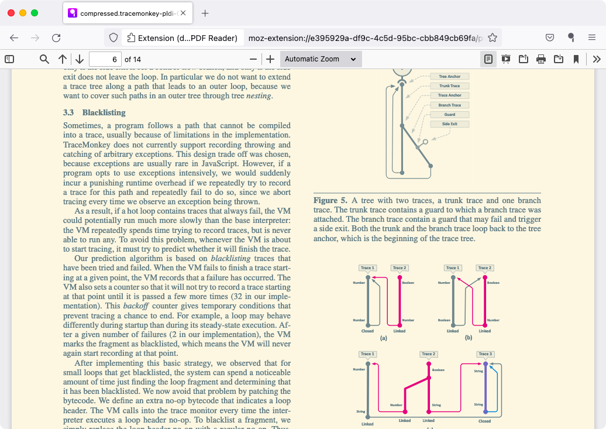

# doqment

*doqment* (pronounced as *doc-HUE-ment*) is a custom deployment of the
[PDF.js][1] generic viewer with [*doq*][2] reader mode add-on (that lets you
change the PDF's colors) on top, packaged as a Web Extension.

It also adds some other features like Smart Zoom text and Show/Hide toolbar to
optimize space and assist reading, especially on smaller devices.

Here is the demo PDF rendered in *Solarized Light* theme:



View [more screenshots](docs/gallery.md#themes).

## Installation

[  ][4] &nbsp;
[  ][6]

Latest release can be installed from [AMO][4] / [CWS][6], or downloaded from
[Releases][5].

In Firefox, *doqment* replaces the built-in PDF.js viewer as the default PDF
viewer application. In Chrome(ium), it co-exists with the native viewer, and
provides a context menu and toolbar button to open PDFs in it instead.

#### Extension options

Preferences for both the PDF.js viewer and *doq* can be configured through the
extension options page (right click the toolbar icon and choose *Options* or
*Manage Extension* -> *Preferences*).

#### Note for Firefox users:

It is recommended to disable the built-in viewer while this extension is
enabled to avoid funny and weird behaviours while opening/downloading PDFs.
(Go to *Settings* -> *Files and Applications* -> set the *Action* for PDF to
something other than *Open in Firefox*).

#### Note for Chrome(ium) users:

The extension can open PDF links via the context menu whether the native viewer
is enabled or disabled. To always open PDFs in the browser without downloading
them first, keep it enabled. (Go to *Settings* -> *Privacy and security* ->
*Site Settings* -> *Additional content settings* (under *Content*) ->
*PDF documents*; or open `chrome://settings/content/pdfDocuments`).

## Development

**Note:** In Firefox, *doqment* uses Manifest Version 2, while in Chromiums it
uses MV3.

1. Clone this repo recursively (to get the submodules)
2. Update the symlink to the correct manifest file:
```
$ cd src
$ ln -sf manifest-v2.json manifest.json    # for Firefox (default)
$ ln -sf manifest-v3.json manifest.json    # for Chrome, Edge, etc
```
3. Install unpacked via `about:debugging` / `chrome:extensions` (or using
   `web-ext`)
4. Hack to your heart's content and submit a PR!

#### Packaging

Run the `pack.sh` script **from the repo root**:
```
$ ./pack.sh [mv2|mv3]    # default is mv2
```

## Limitations

### Firefox

Compared with the viewer baked right into Firefox's code, an extension is a lot
less previleged and hence, has certain limitations:

1. Cannot load local files via the `file:` URL scheme. The user has to first
   open the extension's viewer in a tab and use the viewer's UI to open them
   (hence a browser toolbar button is provided for this).
2. Cannot use the integrated Findbar to search for text in PDF.
3. The address bar shows an ugly extension URL instead of the original PDF URL
   (hence a popup is provided to quickly show the later).

### Chromium

1. Can open `file:` URLs, only if the user grants access in the extension's
   settings.
2. Redirecting links cannot be opened via the context menu; users will have to
   first open it in the native viewer, and then use the toolbar button.

## Rationale

As the built-in viewer of Firefox is a previleged page, extensions cannot
modify it. Thus a custom deployment is currently the only way to ship add-ons
to the viewer (other than getting your patch merged into PDF.js).

On the plus side, this also enables users of other browsers to have PDF.js and
*doq*.

This project can also be used as a boilerplate by anyone else wishing to
develop their own awesome crazy add-on for the PDF.js viewer.

For the rationale behind reader mode see the [*doq* Readme][3].

Happy PDF Reading!

---

[1]: https://mozilla.github.io/pdf.js/web/viewer.html
[2]: https://github.com/shivaprsd/doq
[3]: https://github.com/shivaprsd/doq#why-doq
[4]: https://addons.mozilla.org/addon/doqment
[5]: https://github.com/shivaprsd/doqment/releases/latest
[6]: https://chrome.google.com/webstore/detail/ajmcpdllaaklaocodbnllhkaflncmlog
