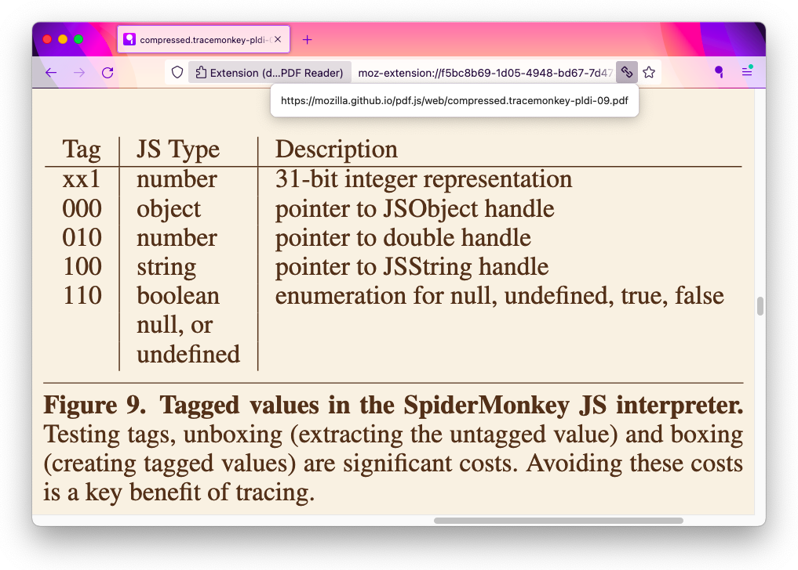

# Screenshots

## Interface

### Firefox Toolbar Button

### Reader Mode Toolbar

### Smart Zoom with Hidden Toolbar

_Also showing Original Link popup button._

### Smart Zoom on Mobile

## Themes

### Nord

### Solarized

### Firefox Reader View

### Safari Reader View

### Invert (Night mode)

---
