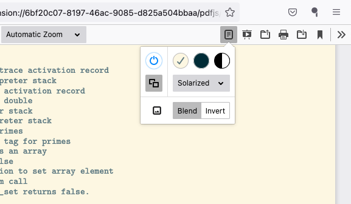
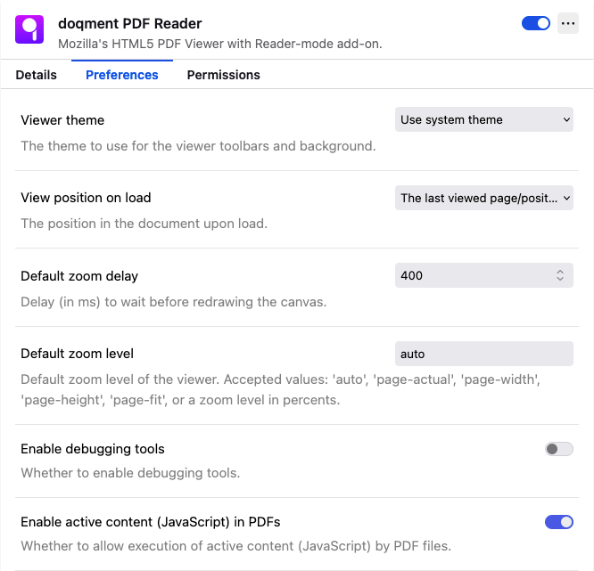
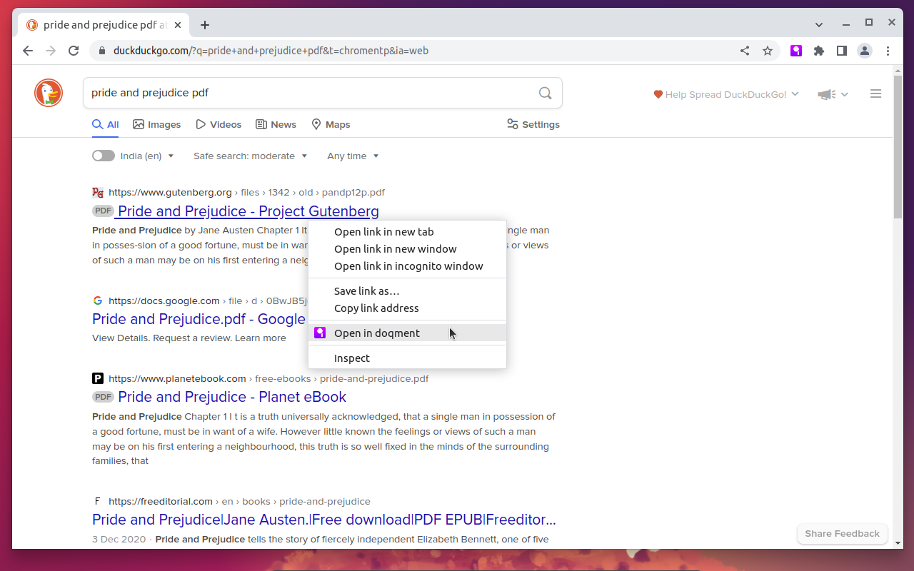
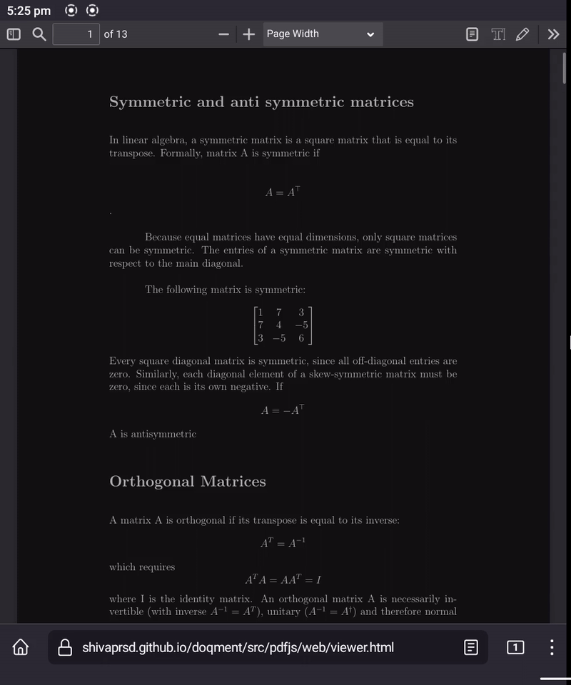
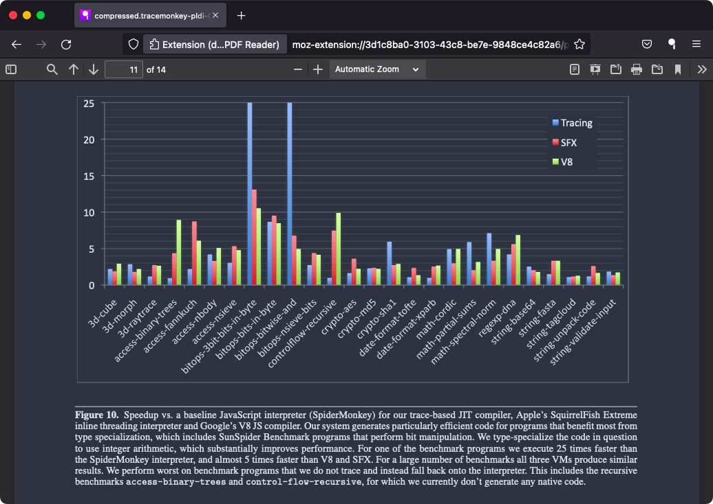
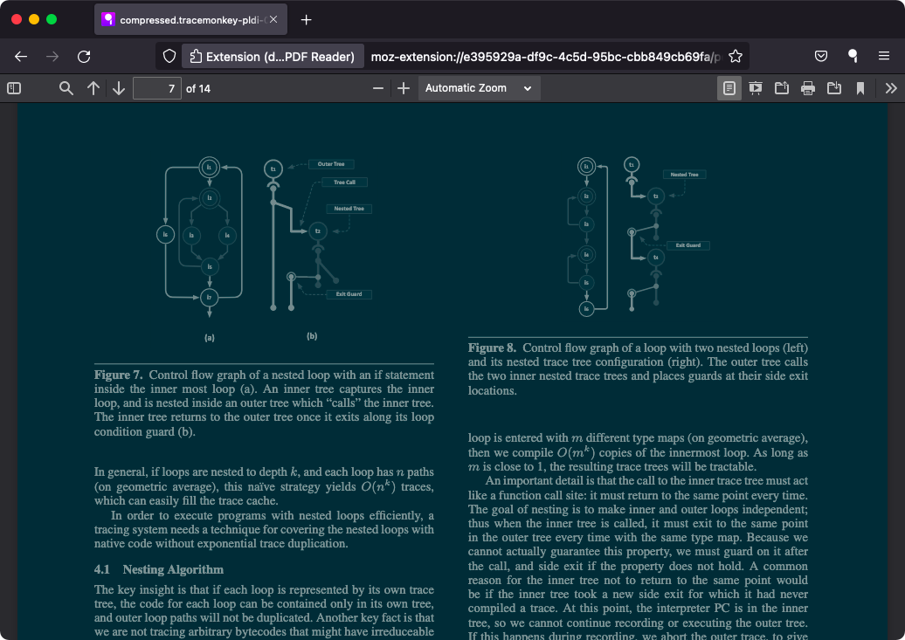
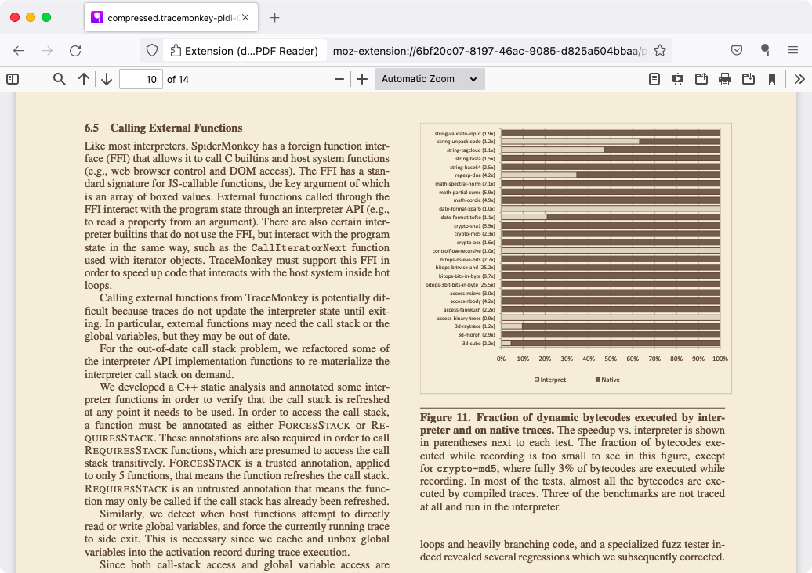
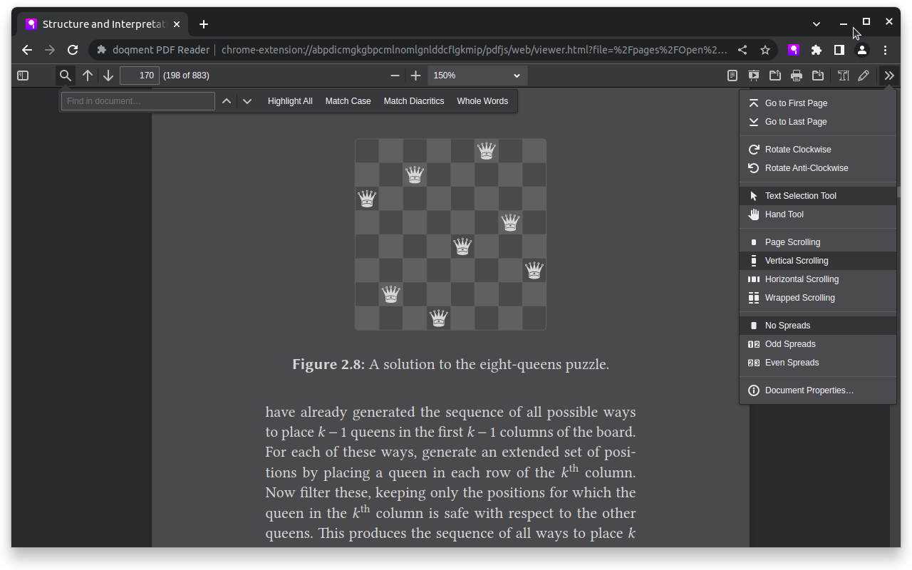
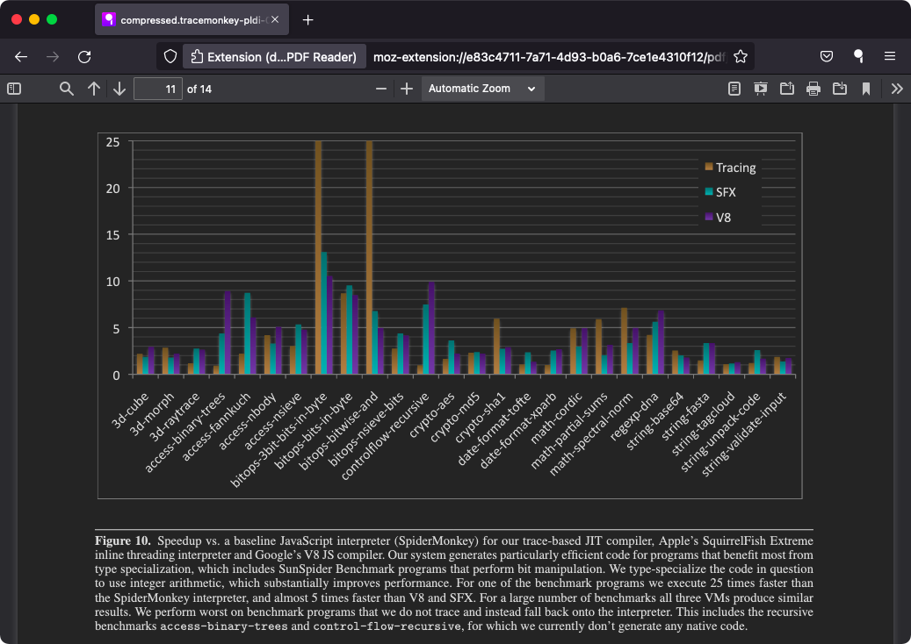

# Screenshots

## Interface

### Toolbar Button

### Reader Mode Toolbar

### Original Link Popup

_Also showing smart-zoomed text and hidden toolbar._

### Viewer Preferences

### Chromium Context Menu

### Smart Zoom

## Themes

### Nord

### Solarized

### Firefox Reader View

### Safari Reader View

### Invert (Night mode)

---
